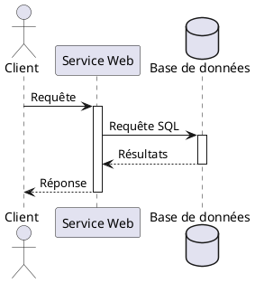
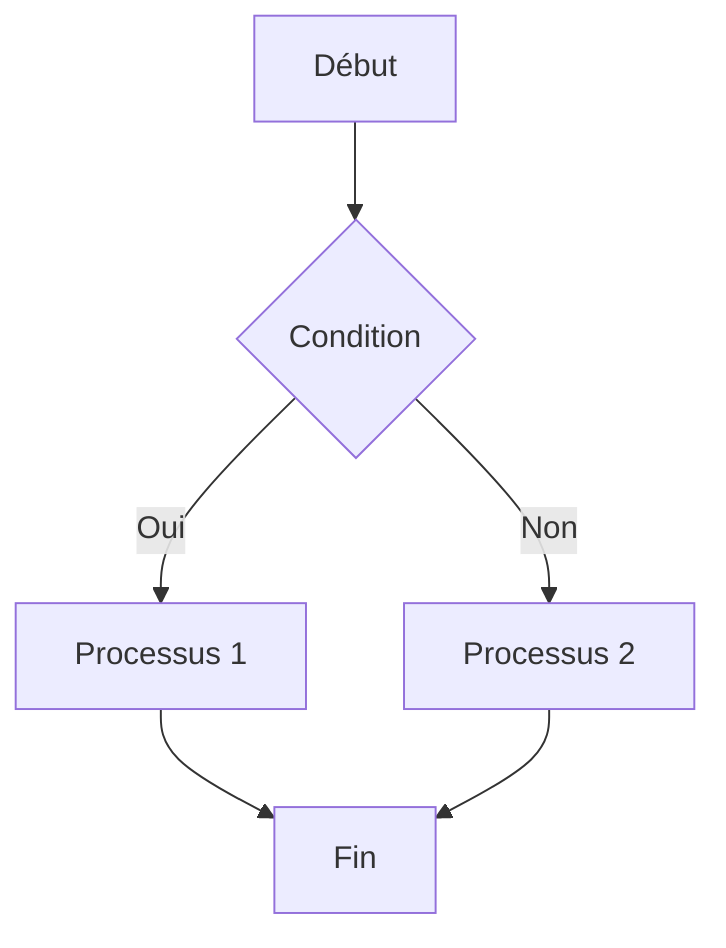

# Document de démonstration

Ce document montre les différentes fonctionnalités du convertisseur Markdown vers PDF/HTML.

## Texte formaté

Voici un exemple de **texte en gras**, *texte en italique*, et `code inline`. Vous pouvez également ~~barrer du texte~~ si nécessaire.

## Listes

### Liste non ordonnée

* Premier élément
* Deuxième élément
  * Sous-élément
  * Autre sous-élément
* Troisième élément

### Liste ordonnée

1. Premier élément
2. Deuxième élément
   1. Sous-élément
   2. Autre sous-élément
3. Troisième élément

## Citation

> Ceci est une citation.
> Elle peut s'étendre sur plusieurs paragraphes.

## Tableau

| Nom      | Âge | Profession     |
|----------|-----|----------------|
| Alice    | 30  | Développeur    |
| Bob      | 45  | Designer       |
| Charlie  | 28  | Product Manager|

## Code source avec coloration syntaxique

### Python

```python
def hello_world():
    """Une fonction simple qui affiche Hello World."""
    print("Hello, World!")
    
    # Une boucle
    for i in range(5):
        print(f"Compte: {i}")
    
    return True

# Appel de la fonction
hello_world()
```

### JavaScript

```javascript
// Une fonction qui calcule la factorielle
function factorial(n) {
  if (n <= 1) return 1;
  return n * factorial(n - 1);
}

// Utilisation de la fonction
console.log("Factorielle de 5:", factorial(5));

// Une classe simple
class Person {
  constructor(name, age) {
    this.name = name;
    this.age = age;
  }
  
  greet() {
    return `Hello, my name is ${this.name} and I'm ${this.age} years old.`;
  }
}
```

### Bash

```bash
#!/bin/bash

# Un script simple qui montre l'utilisation de variables
NAME="Utilisateur"
CURRENT_DIR=$(pwd)

echo "Bonjour $NAME!"
echo "Vous êtes dans le répertoire: $CURRENT_DIR"

# Une boucle
for i in {1..5}; do
    echo "Itération $i"
done
```

## Diagramme PlantUML



## Diagramme Mermaid



## Équation LaTeX

Voici une équation simple:

$$E = mc^2$$

Et une équation plus complexe:

$$
\frac{d}{dx}\left( \int_{a}^{x} f(t)dt \right) = f(x)
$$

## Image


## Liens

Voici un [lien vers Google](https://www.google.com).

## Notes de bas de page

Voici un texte avec une note de bas de page[^1].

[^1]: Ceci est le contenu de la note de bas de page.

## Conclusion

Ce document a montré les principales fonctionnalités que notre convertisseur Markdown prend en charge. Vous pouvez utiliser ce document comme référence pour créer vos propres documents.
